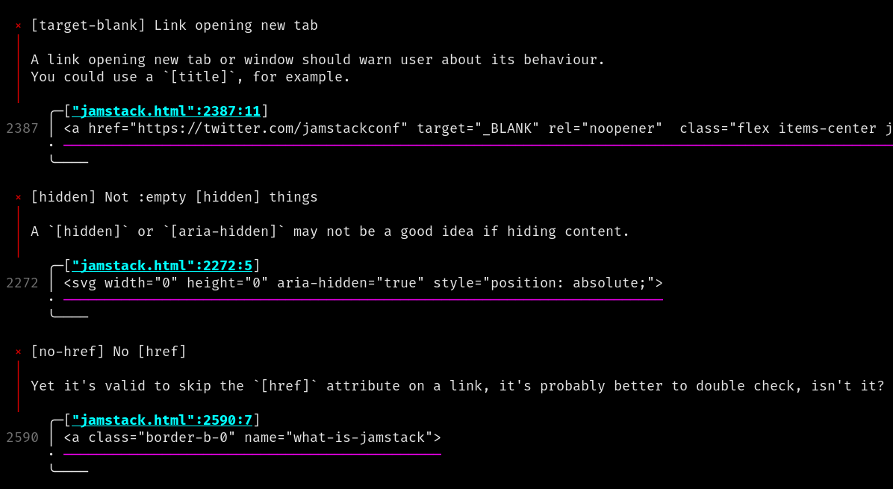
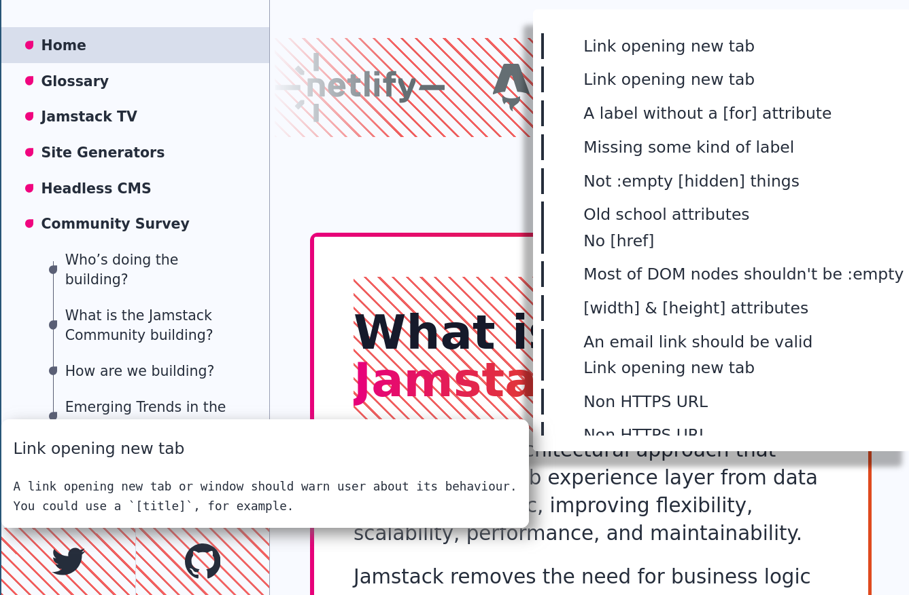

> # ⚠️ This repository is a mirror of [a Codeberg repository](https://codeberg.org/emmabastas/html-lint)
>
> There are many reasons to prefer a community-run platform like Codeberg over something like GitHub which is a for-profit company part of a soft power apparatus. I think [this blogpost](https://seanfobbe.com/posts/2025-04-10_migrating-open-source-code-from-github-to-codeberg/) articulates some of those reasons well.
>
> Please feel free to open issues here! But if you want to have a look at the code then head on over to Codeberg :-)
> [codeberg.org/emmabastas/html-lint](https://codeberg.org/emmabastas/html-lint)
# `html-lint` — Your one-stop shop for HTML linting activities

Whether you're using a templating engine for your server-side rendering, a frontend framework for your SPA, or making a good ol static website: If there's HTML involved, you can lint it using `html-lint`!

There are two ways of using `html-lint`
  1) In the terminal: Give the cli-app files to lint and it will give you a report.
  2) In the browser: `html-lint` can analyses the HTML in the website itself.

<table>
  <tr>
    <td>
      
    </td>
    <td>
      
    </td>
  </tr>
</table>

## Why not use &lt;my favorite HTML linter&gt; instead?

There are many nice HTML linters out there, however `html-lint` tries to be something I have not seen elsewhere:
  - **Universal.** Many html linters are tied to a specific ecosystem: [djlint](https://github.com/djlint/djlint) is tied to `pip` and is for HTML templates only, [html-eslint](https://github.com/yeonjuan/html-eslint?tab=readme-ov-file) is tied to NodeJS and HTML-in-JS. With `html-lint` you can install it with `pip` for your templates on Monday, and then use the same tool via `npm` for React on Tuesday.
  - **zero-config, works for you.** `html-lint` comes with sane defaults so you can focus on making good accessible HTML and not fuss about with configuration. There is always the option of customizing though.
  - **Use it everywhere.** The mix of simultaneously working in the terminal and on the browser isn't something I've seen elsewhre.

## Use in the CLI

### Installing

- **Prebuilt binaries** See [releases](https://codeberg.org/emmabastas/html-lint/releases) for prebuilt binaries
- **npm** `npm install @emmabastas/html-lint`
- **pip** **TODO**
- **cargo** `cargo install html-lint`
- **Build from source** **TODO**

### Usage

Lint all HTML and handlebar files in `src`.

```bash
html-lint src/**/*.html src/**/*.hbs
```

More options with `html-lint --help`.

## Use in the browser

### ⚡Easiest⚡: Use the reverse proxy

Go to [html-lint.notadev.net](https://html-lint.notadev.net) to lint any website without installing anything!

### Easy: Add `<script>` tag to your website.

For modern browsers you can simply add the following somewhere in your HTML

```html
<script type="module">
  import htmlLint from 'https://cdn.jsdelivr.net/npm/@emmabastas/html-lint@0.1.0-0.1.1/+esm'
  htmlLint.init()
</script>
```

(**TODO** Fix script-tag for a "regular" bundle)

The above script tag uses [jsdelivr](https://www.jsdelivr.com/) to deliver the JS, if you want to host it yourself you can find minified JS bundles in [browser/dist/](https://codeberg.org/emmabastas/html-lint/src/branch/main/browser/dist).

### Proper: npm package

Install both the CLI and the in-browser package in your project

```bash
npm install --save-dev @emmabastas/html-lint
```

The next step depends on what bundler you are using. The goal is to run html-lint in development builds only. With [parceljs](https://parceljs.org/) I achieve this by putting the following snippet in some `.js` file that is always loaded by my website.

```javascript
import * as htmlLint from "@emmabastas/html-lint"

if (process.env.NODE_ENV === "development") {
  htmlLint.init()
}
```

## Contributing

Please contribute <3. There are many ways to do so
- Let me know you appreciate this tool: Send me an email or star this repo, makes me really happy!
- Open issues with bugs or things that you want implemented.
- Add/improve linting rules. See [/rules/rules.yaml](TODO) for further information.
- Work on the CLI. See [/cli/README.md](TODO) for further information.
- TODO more.

## License & Acknowledgments

The initial set of linting-rules where adapted from [a11y.css](https://github.com/ffoodd/a11y.css). Without that project this project would probably not be, so huge shoutout <3.

The following files belong to the [duktape.org](https://duktape.org) project and are licensed under the MIT license.
- [cli/src/duk_config.h](TODO)
- [cli/src/duk_source_meta.json](TODO)
- [cli/src/duktape.c](TODO)
- [cli/src/duktape.h](TODO)

The project uses uses some icons from [CSS＊GG](https://css.gg). Whenever you see an HTML element with a class-name prefixed by `gg-` that icon is from [CSS＊GG](https://css.gg).

All other code in this repository is owned by each respective contributor and licensed under the GNU Affero General Public License version 3 or later (AGPL-3.0-or-later). The license is found in [LICENSE](TODO).
